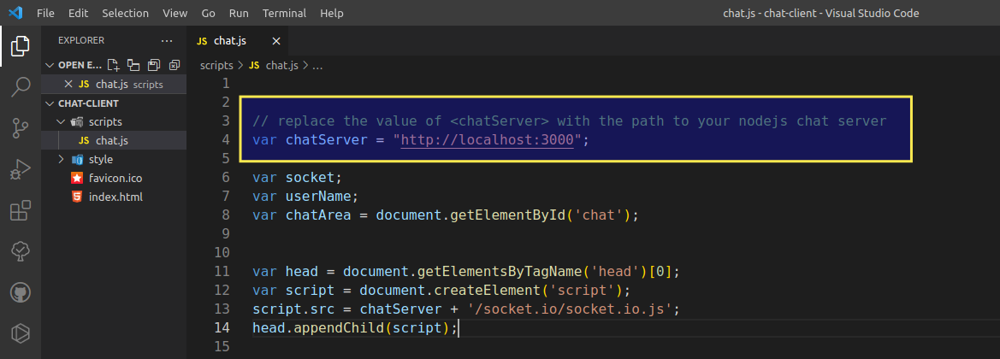

# Chat frontend

This is the chat frontend (HTML, JS - NO FRAMEWORK)

The backend is available at:

https://github.com/ArielBarkan/spike_chat_server

A video of the chat working is available at:

https://www.youtube.com/watch?v=J_VZ8-s_1GM

You can run the chat client in your browser (index.html) no server required, but modify accordingly the URL of the chat server in the "chatServer" var (see image below):

## Task ⛏️

As part of the interviewing process, I am asking you to develop the server side of a basic Real-Time Chat application.
Please read the following requirements carefully:

The propose of this chat app is to enable any user to participate in a free, open chat channel.
Any user can enter the application and start chatting with other users in a public chat channel.

Must-have requirements:

    1.    Use Node.js - You can use a WebSocket module/library as per your choice.
    2.    The following API methods should be implemented: join, send, leave. You may implement more API methods if you see fit.
    3.    The application should be scalable - i.e. it should be possible to add more than one server to support a large amount of users.
    4.    There should be descriptive logs showing when a user connects, sends a message, etc. + every 10 seconds there should be a summary log including amount of connected users and total number of messages.

You don't have to implement persistent storage, you may if you want.

It's up to you to add more functionality as you want.
Anyhow, It's important that you will first focus on the Must Have requirements.
